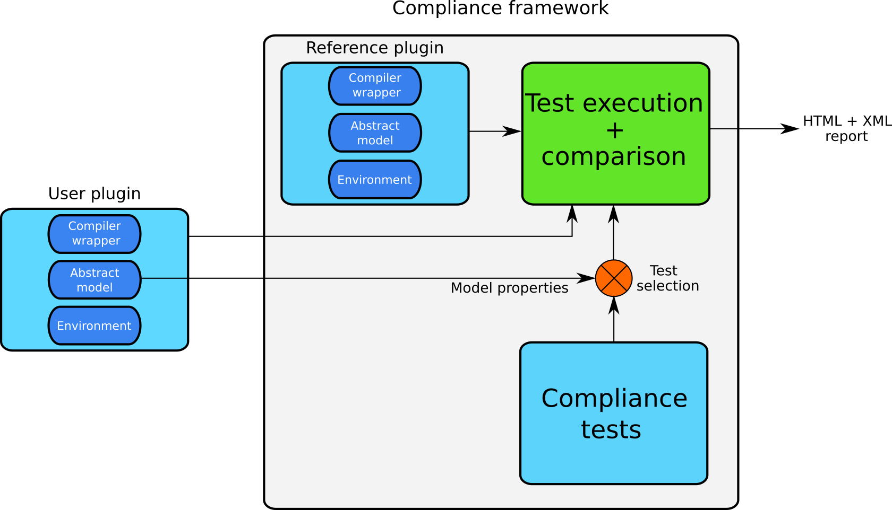
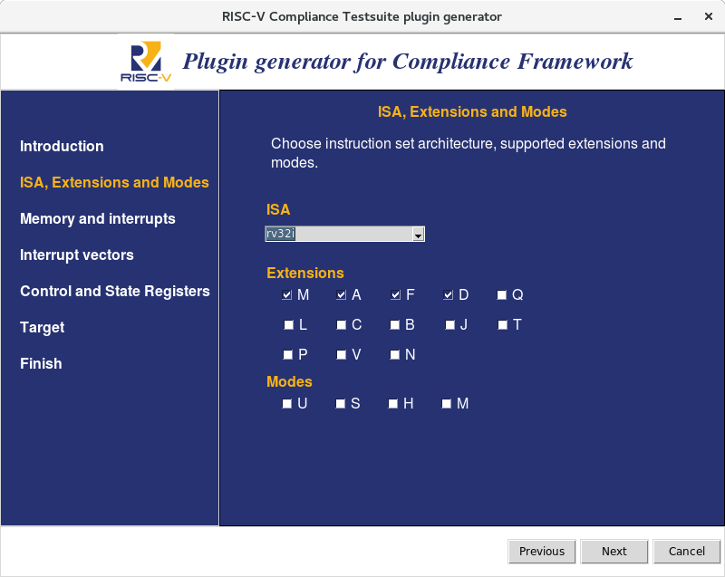

.. RISC-V Compliance Framework documentation master file, created by
   sphinx-quickstart on Tue Nov 13 10:41:50 2018.
   You can adapt this file completely to your liking, but it should at least
   contain the root `toctree` directive.

.. _RISCVspec: https://riscv.org/specifications/
.. _Python3: http://www.python.org/
.. _Pytest: https://docs.pytest.org/en/latest
.. _PytestFixtures: https://docs.pytest.org/en/latest/fixture.html

Welcome to the documentation of RISC-V Compliance Framework!
============================================================

RISC-V Compliance Framework is a framework for automatic compliance testing of RISC-V models. The primary goals of this framework are:

* Verify if model is compliant with `RISC-V standard <RISCVspec_>`_
* Support any type of RISC-V processor implementation (``SW simulator``, ``RTL``, ``HW board``, ...)
* Easily extensible with new tests or features in `RISC-V specification <RISCVspec_>`_
* Automatic test selection based on model configuration
* Simple and intuitive user interface
* System independent (``Linux`` and ``Windows`` systems)

Compliance framework is written in `Python 3 <Python3_>`_ and is using `Pytest <Pytest_>`_ framework which is a great choice for customizing the testing process. 
Framework is designed to be easily extended with new features, which will come with future RISC-V specification modifications. 
Python language has been chosen because it is high-level language which allows to write code fast while keeping it readable. With large Python community, 
there is almost everything already implemented.

Overview
========

Compliance framework is a **plugin-based** framework, which means that integration of RISC-V model into framework is done via plugin. 
This brings the advantage of portability and templating. Once a plugin is written it can be moved to any other computer and can 
be reused there without any modifications. 

The block scheme of framework is shown in the picture below.

RISC-V Compliance framework plugin
==================================

Each RISC-V Compliance framework plugin consists of three components:

* **Compiler wrapper** - Object which is responsible for source compilation into format which can be later simulated on tested RISC-V model. Framework implements RISC-V GCC-compatible compiler wrapper and it is used as a default, but custom compiler wrappers (for custom toolchains) are supported as well.
* **Abstract model** - Object describing model configuration and is responsible for correct simulation process. Object needs to implement method for execution of compiled binary test file and signature extraction.
* **Environment** - Object representing set of header files, linker scripts and other files which are needed for correct source compilation. These (header) files must be part of the plugin. Environment object provides simple interface for files detection.

Plugin has the following directory structure:

* ``environment``
	* ``include``
		* \<header_file1\>
		* \<header_file2\>
		* ...
		* \<header_filex\>
* ``__init__.py`` - Creates a package from plugin, so it can be imported and used (necessary file, but may remain empty).
* ``compiler.py`` - Contains compiler wrapper implementation.
* ``rvtest_plugin.py`` - Contains model configuration, behaviour definition and specifies how each plugin component is loaded into framework via `Pytest fixtures <PytestFixtures_>`_.

RISC-V Compliance framework plugin requires some header files containing macros definition which is specific for each RISC-V processor. These header files are included in source files of the tests. Framework expects these files located in ``<plugin_path>/environment/include`` directory. List of mandatory header files can be found in :py:data:`_rvtest.MANDATORY_HEADER_FILES`.

Plugin generator
~~~~~~~~~~~~~~~~

To minimize user's effort while integrating his model into framework, a plugin generator is implemented. Plugin generator automatically generates standard directory structure and allows 
user to specify the configuration of his model. In the end, plugin for RISC-V model with chosen configuration is generated. It supports both graphical and text modes. For running 
the graphical mode, Tkinter library is required (see _setupsection section). Plugin generator is implemented as a wizard (using next, next, next...). Plugin generator supports
predefined plugin templates for specific targets. These templates have already defined methods for binary execution and signature extraction. When choosing ``default`` template, you
have to implement these methods as framework does not have any information about the platform.

Currently, there exist templates for the following targets:

* ``Codasip simulator``
* ``OVPsim``

Preview of the plugin generator in graphical mode is shown in the following figure. 

.. _setupsection:

Setup
=====

Install prerequisities
~~~~~~~~~~~~~~~~~~~~~~

Run the following command in your command line

``pip install pytest pytest-html pytest-xdist Pillow``

.. _setuptkinter:

Plugin generator in graphical mode uses Tkinter library, which cannot be installed via pip, but should be available in distribution repositories.

For Debian-like systems:

``$ sudo apt-get install python3-tk``

For Centos-like systems:

``$ sudo yum install python3-tkinter or $ sudo yum install python36u-tkinter`` 

For Windows systems:

* Tkinter is installed when installing Python (if Tcl/Tk has not been disabled during installation)

Compliance framework requires RISC-V Toolchain and reference model Spike. If these tools are not already built on your computer, 
please view ``https://github.com/riscv/riscv-tools`` and build them as described in the repository. If you have these tools built earlier, 
make sure that environmental variable ``$RISCV`` points to the installation directory, where tools are built.

Execution
=========

Compliance framework provides single entry-point script named ``rvtest.py``. Use ``--help`` argument to view all available arguments. 
Note that Compliance framework help contains Pytest arguments as well. To view arguments specific for Compliance framework, search for help section named **RV Compliance**.

There are some mandatory arguments which are required for Compliance framework execution:

* ``--model`` - Path to executable of user model or an file (executable/script/...) which provides interface to the model. 

* ``--plugin`` - Path to plugin containing configuration specification and behaviour definition

When testing process is executed, framework does these steps:

1. Framework loads the user plugin and configures the abstract model instance
2. Framework searches for all available compliance tests from `compliance_tests` directory
3. Framework matches tests' requirements and model properties (configuration) and generates tests which are expected to pass on given RISC-V model
4. Framework compiles test for both reference and user models (compilation may be different for each model), then simulates it on reference and user model
5. When simulation is over, abstract model implementation is responsible for signature extraction from user model
6. Framework compares signatures from reference and user model
7. When all tests are finished, framework generates HTML and XML reports and prints the summary to terminal giving the user information if his model is or is not RISC-V compliant

.. toctree::
   :maxdepth: 2
   :caption: Contents:

Indices and tables
==================

* :ref:`genindex`
* :ref:`modindex`
* :ref:`search`